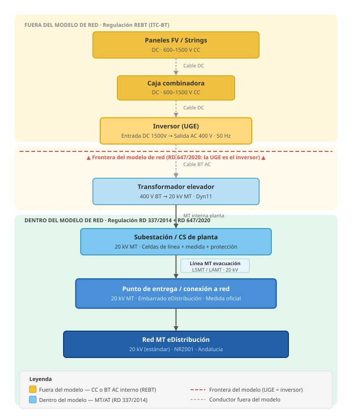

# Modelo de datos — Elementos de generación y almacenamiento

## Esquema de tensiones — de paneles al punto de entrega en red



---

## Cobertura en IEC CIM 61970

La edición **IEC 61970-301:2020 (Ed. 7)** cubre generación renovable y almacenamiento
de forma explícita. Versiones anteriores (2013/2016) eran deficientes en este área,
por lo que es importante usar la edición 2020 como referencia.

### Jerarquía de clases CIM para generación

```
GeneratingUnit (base)
  ├── SolarGeneratingUnit         → planta fotovoltaica (nivel agregado)
  ├── WindGeneratingUnit          → parque eólico (nivel agregado)
  ├── HydroGeneratingUnit
  └── ThermalGeneratingUnit

PowerElectronicsUnit (base — para recursos conectados vía electrónica de potencia)
  ├── BatteryUnit                 → batería / almacenamiento
  ├── PhotovoltaicUnit            → módulo FV individual / inversor
  └── PowerElectronicsWindUnit    → aerogenerador con convertidor AC/DC/AC

PowerElectronicsConnection      → punto de conexión del recurso PE a la red AC
```

`GeneratingUnit` representa el recurso de generación a nivel de planta o parque.
`PowerElectronicsUnit` representa cada unidad individual conectada por electrónica
de potencia (inversor, aerogenerador tipo 4, batería).

---

## Marco normativo español

### Terminología RD 647/2020 (Códigos de Red de conexión)

El RD 647/2020 transpone los Reglamentos EU 2016/631 y 2016/1388 al derecho español.
Define la jerarquía de una instalación de generación:

| Término   | Definición                                                                 | Equivalente CIM         |
|-----------|----------------------------------------------------------------------------|-------------------------|
| **MGE**   | Módulo de Generación de Electricidad — la instalación completa             | `GeneratingUnit`        |
| **UGE**   | Unidad de Generación de Electricidad — cada generador individual           | `PowerElectronicsUnit`  |
| **CAMGE** | Componentes Adicionales del MGE — elementos activos que no son UGE         | Equipos auxiliares      |

Precisiones importantes del RD 647/2020:
- En FV: **solo el inversor** es la UGE (el lado DC — paneles, strings — no forma
  parte de la planta de generación principal a efectos de conexión a red)
- En eólica: **el aerogenerador completo** (torre + palas + góndola) es la UGE
- Almacenamiento híbrido: puede compartir el mismo punto de conexión con la
  generación si se cumplen requisitos técnicos

### Normativa de referencia

| Norma                  | Contenido                                                          |
|------------------------|--------------------------------------------------------------------|
| **RD 997/2025**        | Redefine potencia instalada — bifacial ×1,15, almacenamiento, híbridas |
| **RD 647/2020**        | Implementación códigos de red UE para generación y almacenamiento  |
| **RD 1183/2020**       | Acceso y conexión a redes de transporte y distribución             |
| **PO 12.2 (REE)**      | Requisitos mínimos instalaciones de generación conectadas a REE    |
| **ITC-BT (RD 842/2002)** | REBT — regula el lado BT/DC interno de las instalaciones FV     |
| **RD 244/2019**        | Condiciones técnicas y económicas del autoconsumo                  |
| **IEC 61970-302:2024** | Modelos dinámicos: aerogeneradores tipo 1–4, inversores, baterías  |

Fuentes:
- [RD 997/2025 — BOE](https://www.boe.es/buscar/act.php?id=BOE-A-2025-22434)
- [Cómo calcular potencia instalada RD 997/2025 — Haz Energía](https://hazenergia.es/como-calcular-la-potencia-instalada-segun-el-rd-997-2025-en-plantas-renovables-e-hibridas/)
- [RD 647/2020 — BOE](https://boe.es/eli/es/rd/2020/07/07/647)
- [PO 12.2 REE instalaciones generación — ESIOS (PDF)](https://api.esios.ree.es/documents/449/download?locale=es)
- [PowerElectronicsUnit — CIM Datamodel (Zepben)](https://zepben.github.io/evolve/docs/cim/ewb/IEC61970/Base/Generation/Production/PowerElectronicsUnit/)
- [IEC 61970-302:2024 Dynamics — IEC Webstore](https://webstore.iec.ch/en/publication/68152)
- [Extensión IEC 61970 para almacenamiento — ResearchGate](https://www.researchgate.net/publication/292358936_Extension_of_IEC_61970_for_electrical_energy_storage_modelling)

---

## Tablas propuestas

### `elemento_generacion` — planta o parque (nivel MGE)

Hereda de `elemento` (misma tabla base que el resto de la red).

| Columna               | Tipo       | Descripción                                                  |
|-----------------------|------------|--------------------------------------------------------------|
| elemento_id           | UUID PK/FK |                                                              |
| subtipo               | TEXT       | fotovoltaica / eolica / hidraulica / almacenamiento / hibrida / cogeneracion |
| potencia_nominal_kw   | NUMERIC    | Potencia nominal de conexión a red en kW (dato del proyecto) |
| tension_conexion_kv   | NUMERIC    | Tensión en el punto de conexión a la red MT/AT               |
| num_unidades          | INTEGER    | Número de UGE (inversores, aerogeneradores, módulos batería)  |
| factor_capacidad      | NUMERIC    | Factor de capacidad típico (0–1), orientativo                |

> **`potencia_instalada_kw` a nivel de planta** no es columna almacenada sino
> agregación calculada mediante la vista `v_potencia_planta` (Σ subcampos).
> Ver ADR-005.

> **Naturaleza del dato**: `potencia_instalada_kw` es un dato **administrativo-legal**,
> no operacional. Determina la competencia para tramitar la autorización (umbral
> 50 MW de la Junta de Andalucía) y el régimen retributivo. No refleja la potencia
> en servicio en un instante dado — eso depende del estado de cada elemento y se
> calcula en el backend filtrando por estado. Ver ADR-005.

---

### `unidad_generacion` — UGE individual (inversor, aerogenerador, módulo batería)

Equivale a `PowerElectronicsUnit` en CIM. No hereda de `elemento` directamente
porque son activos eléctricos internos de la planta, sin conectividad MT propia.

| Columna               | Tipo       | Descripción                                                  |
|-----------------------|------------|--------------------------------------------------------------|
| id                    | UUID PK    |                                                              |
| elemento_generacion_id| UUID FK    | Planta a la que pertenece                                    |
| subtipo               | TEXT       | inversor_fv / aerogenerador / modulo_bateria / microturbina  |
| potencia_nominal_kw   | NUMERIC    | Potencia nominal de la unidad en kW                          |
| tension_salida_v      | NUMERIC    | Tensión de salida AC en voltios (típico: 400V BT)            |
| fabricante            | TEXT       |                                                              |
| modelo                | TEXT       |                                                              |
| num_serie             | TEXT       | (nullable)                                                   |

---

### `almacenamiento` — características específicas de baterías/sistemas de almacenamiento

Complementa `unidad_generacion` cuando `subtipo = modulo_bateria` o
`elemento_generacion.subtipo = almacenamiento`.

| Columna               | Tipo       | Descripción                                                  |
|-----------------------|------------|--------------------------------------------------------------|
| id                    | UUID PK    |                                                              |
| unidad_id             | UUID FK    | Unidad de generación (módulo batería)                        |
| tecnologia            | TEXT       | litio_ion / plomo_acido / flujo_vanadio / hidrogeno / otro   |
| capacidad_kwh         | NUMERIC    | Capacidad energética nominal en kWh                          |
| potencia_carga_kw     | NUMERIC    | Potencia máxima de carga                                     |
| potencia_descarga_kw  | NUMERIC    | Potencia máxima de descarga                                  |
| ciclos_vida           | INTEGER    | Ciclos de carga/descarga nominales                           |
| dod_pct               | NUMERIC    | Profundidad de descarga máxima en % (Depth of Discharge)     |
| soc_inicial_pct       | NUMERIC    | Estado de carga inicial nominal en %                         |

---

### `subcampo_fv` — agrupación operativa de paneles bajo un inversor

Representa la "isla de paneles" que conecta a un inversor concreto. Es la unidad
mínima con potencia instalada propia a efectos legales (RD 997/2025 Art. 5).
Nomenclatura elegida por ser el término estándar en el sector FV español. Ver ADR-004.

No hereda de `elemento`: es un activo interno de la planta (lado DC), fuera del
modelo de red MT. Ver ADR-003.

| Columna                    | Tipo             | Descripción                                                   |
|----------------------------|------------------|---------------------------------------------------------------|
| id                         | UUID PK          |                                                               |
| elemento_generacion_id     | UUID FK          | Planta a la que pertenece                                     |
| unidad_generacion_id       | UUID FK          | Inversor (UGE) al que conectan estos paneles                  |
| nombre                     | TEXT             | Denominación operativa ("Zona A", "Bloque 3", "Tracker 12")   |
| potencia_pico_modulos_kwp  | NUMERIC          | Σ potencias pico módulos en STC (kWp)                        |
| potencia_nominal_inversor_kw | NUMERIC        | Potencia nominal AC del inversor (kW)                         |
| es_bifacial                | BOOLEAN          | Si los módulos son bifaciales                                 |
| factor_bifacial            | NUMERIC          | Factor cara trasera. Default 1.15 (RD 997/2025 Art. 5.2)     |
| **potencia_instalada_kw**  | NUMERIC GENERATED | `LEAST(potencia_pico × factor_bifacial_efectivo, inversor)` — valor legal RD 997/2025 |
| num_modulos                | INTEGER          | Número total de paneles                                       |
| num_strings                | INTEGER          | Número de strings                                             |
| modulos_por_string         | INTEGER          | Paneles en serie por string                                   |
| potencia_modulo_wp         | NUMERIC          | Potencia unitaria del panel en Wp (STC)                       |
| tecnologia_modulo          | TEXT             | monocristalino / policristalino / CdTe / CIGS / HJT           |
| orientacion_grados         | NUMERIC          | Azimut (0°=Norte, 90°=Este, 180°=Sur)                        |
| inclinacion_grados         | NUMERIC          | Ángulo de inclinación sobre horizontal                        |
| seguimiento                | TEXT             | fijo / un_eje / dos_ejes                                      |
| geom                       | GEOMETRY(Polygon)| Polígono del subcampo (PostGIS, nullable)                     |

**Fórmula columna generada** (PostgreSQL):

```sql
potencia_instalada_kw NUMERIC GENERATED ALWAYS AS (
  LEAST(
    potencia_pico_modulos_kwp * CASE WHEN es_bifacial THEN factor_bifacial ELSE 1.0 END,
    potencia_nominal_inversor_kw
  )
) STORED
```

**Vista de agregación a nivel de planta** (no columna almacenada):

```sql
CREATE VIEW v_potencia_planta AS
SELECT elemento_generacion_id,
       SUM(potencia_instalada_kw) AS potencia_instalada_total_kw
FROM subcampo_fv
GROUP BY elemento_generacion_id;
```

---

## Límites del modelo: qué queda fuera (lado DC/BT interno)

El lado DC de una planta fotovoltaica (paneles, strings, cajas de protección DC,
cableado CC) **no forma parte del modelo de red MT/AT**:

- Está regulado por el REBT (ITC-BT), no por el Reglamento AT
- El CIM no modela el interior DC de una planta FV
- El punto de entrada al modelo es el **inversor** (UGE), que es donde el recurso
  conecta a la red AC

```
Paneles FV → strings → caja combinadora → inversor ← PUNTO DE ENTRADA AL MODELO
                                             ↓
                                    transformador BT/MT
                                             ↓
                                      red MT (20 kV)
```

Lo mismo aplica al lado BT de un parque eólico: el modelo MT empieza en el
transformador del aerogenerador (o del parque), no dentro de la góndola.

---

## Conectividad con el resto del modelo

`elemento_generacion` **sí hereda de `elemento`** y por tanto tiene terminales
y conecta a nodos como cualquier otro elemento de red:

- Terminal 1 del elemento_generacion → nodo MT de conexión
- Si tiene transformador elevador propio: terminal 2 → nodo BT interno

La `unidad_generacion` no tiene terminales de red propios: está contenida dentro
de la envolvente de la planta (si existe).

---

## Pendiente de definir

- Curvas de potencia de aerogeneradores (tabla `curva_potencia_eolica`)
- Perfiles de generación FV (irradiación, inclinación, orientación)
- Requisitos de PO 12.2 para control de reactiva y tensión en punto de conexión
- Medidas y contadores SCADA asociados a la generación
